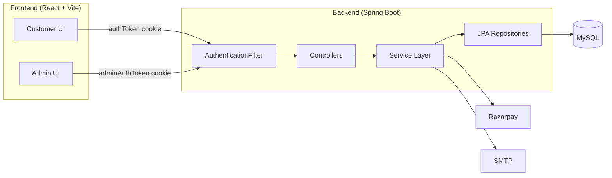
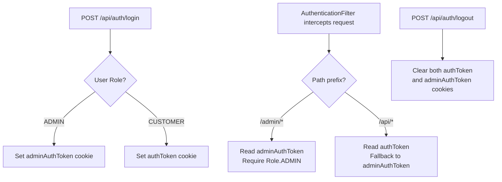
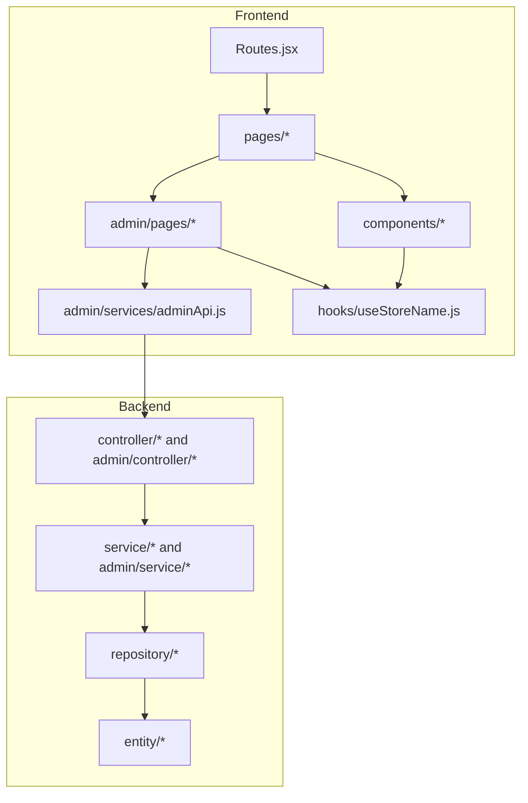
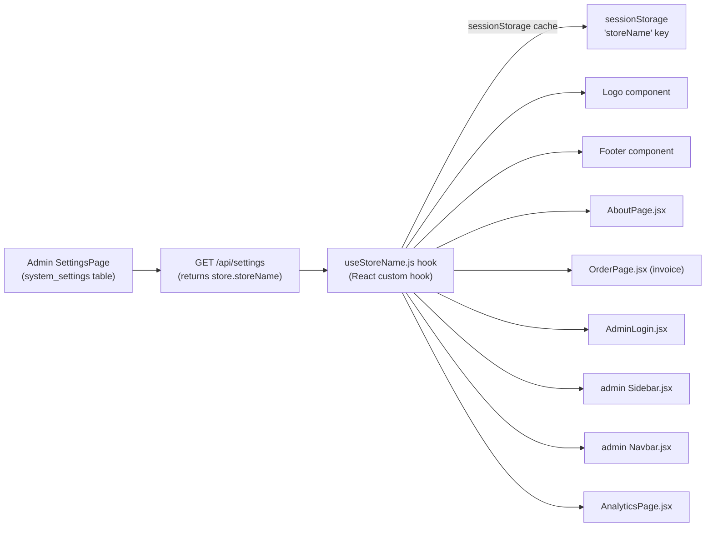
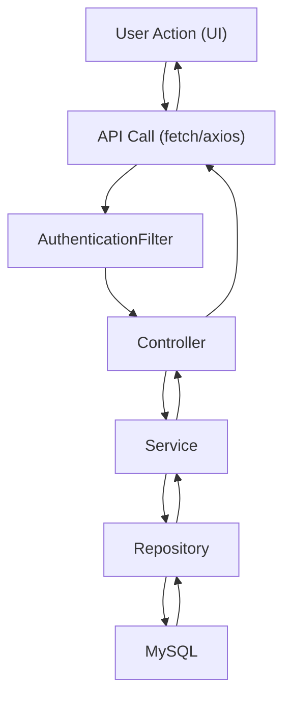

# NexCart Architecture

## Overview
NexCart is a full-stack platform split into three main layers.
- Customer and admin UIs in a React SPA (Vite)
- Spring Boot REST API providing business logic
- MySQL for persistent storage

All authenticated traffic uses HttpOnly JWT cookies. The backend enforces role-based access and exposes separate admin endpoints under `/admin`. Dual-cookie isolation (`authToken` / `adminAuthToken`) allows concurrent Customer and Admin sessions without cookie conflicts.

## System Architecture Diagram

## Dual-Cookie Authentication Design

## Component Diagram

## Dynamic Branding Architecture

## Data Flow Diagram

## Frontend Architecture
Entry points
- `NexCartFrontend\src\main.jsx` mounts the React app
- `NexCartFrontend\src\App.jsx` wires routes and layout

Routing
- All routes are defined in `NexCartFrontend\src\routes\Routes.jsx` and include customer, support, and admin areas

Custom Hooks
- `NexCartFrontend\src\hooks\useStoreName.js` — fetches and caches the store name from `system_settings` via `/api/settings`. Used by all branding-sensitive UI components.

UI modules
- Customer UI lives under `NexCartFrontend\src\pages\customer`
- Admin UI lives under `NexCartFrontend\src\admin`
- Shared UI elements live under `NexCartFrontend\src\components`

State and data flow
- REST calls use `fetch` in pages and `adminApi` in admin features
- Cookies are sent via `credentials: "include"` to carry JWT auth
- System settings and coupons are fetched on the checkout page to drive pricing and payment options
- Store name is cached in `sessionStorage` by `useStoreName.js` to avoid redundant API calls

## Backend Architecture
Layering
- Controllers map HTTP endpoints to use cases
- Services implement business logic and workflows
- Repositories provide persistence via Spring Data JPA
- Entities map to MySQL tables

Security
- `AuthenticationFilter` intercepts `/api/*` and `/admin/*`
- `/admin/*` routes exclusively use `adminAuthToken` and require `Role.ADMIN`
- `/api/*` routes read `authToken` with a fallback lookup to `adminAuthToken` for shared endpoints
- JWT is stored in `jwt_tokens` table for revocation

Key service responsibilities
- `AuthService` handles login, JWT creation, dual-cookie assignment, and reset tokens
- `PaymentService` calculates totals and coordinates Razorpay/COD flows
- `OrderService` assembles order history and return requests
- `SystemSettingsService` caches and groups settings for store, tax, shipping, and payment
- `SupportTicketService` validates and logs customer tickets

Admin controllers (11 controllers)
- `AdminDashboardController`, `AdminBusinessController`
- `AdminProductController`, `AdminCategoryController`
- `AdminOrderController`, `AdminCouponController`
- `AdminUserController`, `AdminUsersController`
- `AdminSupportController`, `AdminSettingsController`
- `AdminNotificationController`

Customer controllers (13 controllers)
- `AuthController`, `UserController`
- `ProductController`, `CategoryController`
- `CartController`, `PaymentController`
- `OrderController`, `CouponController`
- `ReviewController`, `SupportController`
- `StoreController`, `SystemSettingsController`
- `UserNotificationController`

## Client-Server Communication
- All API traffic uses JSON over REST
- Authenticated requests use HttpOnly cookies (`authToken` or `adminAuthToken`)
- CORS is restricted to known origins and `allowCredentials=true`
- On unauthorized responses, the admin UI redirects to `/admin`

## Module Interactions
- Cart → Checkout → Payment → Orders → Returns
- Support tickets are created from the customer UI and also from return requests
- Admin order updates cascade to return status updates and refunds
- System settings affect pricing, shipping, tax, and payment options in real time
- Store name changes in Admin SettingsPage propagate to all frontend components via `useStoreName.js`

## Architectural Notes
- The separate dashboard template in `dashboard_import/` is not wired into the main app
- Backend is configured with `spring.jpa.hibernate.ddl-auto=update`, so some tables are created via JPA
- Password reset flows use captcha and rate limiting, and audit logs are stored for admin visibility
- `useStoreName.js` uses `sessionStorage` for in-session caching; a page refresh re-fetches from the API
