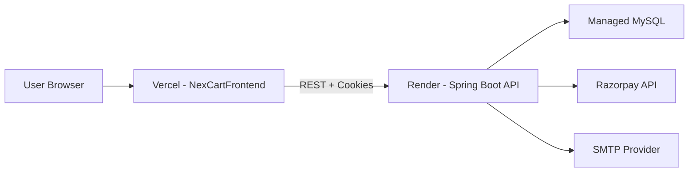

# NexCart Deployment

## Local Setup

### Backend
1. Configure `C:\Users\anupa\OneDrive\Desktop\NexCart\nexcartBackEnd\src\main\resources\application.properties`.
2. Ensure MySQL is running and accessible.
3. Start API:
```bash
cd nexcartBackEnd
./mvnw spring-boot:run
```

### Frontend
1. Configure `C:\Users\anupa\OneDrive\Desktop\NexCart\NexCartFrontend\.env.local` with:
```
VITE_API_URL=http://localhost:9090
```
2. Start UI:
```bash
cd NexCartFrontend
npm install
npm run dev
```

## Required Environment Variables
Recommended for production (replace application.properties values with env vars)
- `SPRING_DATASOURCE_URL`
- `SPRING_DATASOURCE_USERNAME`
- `SPRING_DATASOURCE_PASSWORD`
- `JWT_SECRET`
- `RAZORPAY_KEY_ID`
- `RAZORPAY_KEY_SECRET`
- `SPRING_MAIL_HOST`
- `SPRING_MAIL_PORT`
- `SPRING_MAIL_USERNAME`
- `SPRING_MAIL_PASSWORD`
- `APP_FRONTEND_BASE_URL`
- `APP_FRONTEND_RESET_PATH`

Frontend
- `VITE_API_URL`

## Production Deployment

### Backend (Jar)
1. Build the jar:
```bash
cd nexcartBackEnd
./mvnw -DskipTests package
```
2. Run:
```bash
java -jar target/*.jar
```
3. Use a process manager like systemd or PM2 for Java.

### Backend (Docker)
The backend includes a Dockerfile at `C:\Users\anupa\OneDrive\Desktop\NexCart\nexcartBackEnd\Dockerfile`.

Build and run:
```bash
cd nexcartBackEnd
docker build -t nexcart-backend .
docker run -p 9090:9090 --env-file .env nexcart-backend
```

### Frontend (Static Host)
1. Build frontend:
```bash
cd NexCartFrontend
npm run build
```
2. Deploy `NexCartFrontend\dist` to Vercel, Netlify, or Nginx.
3. Set `VITE_API_URL` for your backend URL.

## Reference Production Topology
This diagram reflects a common deployment aligned with the current config and repository notes: frontend on Vercel, backend on Render, and a managed MySQL instance.



## Server Setup Steps
- Create a production database and run `nexcart_schema.sql` and seed scripts
- Set `JWT_SECRET` to a 64+ character value
- Configure SMTP for password reset emails
- Lock down CORS to the production frontend domain
- Enable HTTPS and secure cookies in production

## Database Initialization
You can initialize the DB with:
- `nexcart_schema.sql` for base schema
- `nexcart_seed.sql` for minimal seed data
- `nexcart_full_setup.sql` to run both in one script

## Monitoring and Logs
- Use Spring Boot logs (INFO level by default)
- Consider adding centralized logging and metrics for production
