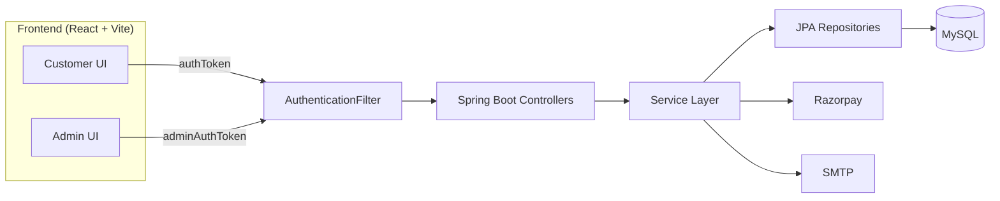

# NexCart Project Documentation

Last Updated: May 2026

## 1. Overview
NexCart is a full-stack e-commerce platform with a customer storefront and an admin operations console. The frontend is a React (Vite) SPA and the backend is a Spring Boot REST API using JPA/Hibernate with a MySQL database. Authentication uses JWT stored in HttpOnly cookies with a **dual-cookie architecture** that isolates Admin and Customer sessions. The system supports catalog browsing, cart management, checkout with Razorpay or COD, order tracking, return requests, support tickets, and **dynamic store branding** controlled from the Admin panel.

## 2. Repository Layout
- `NexCartFrontend/` React app for customer and admin UI
- `nexcartBackEnd/` Spring Boot API and data layer
- `dashboard_import/react-admin-dashboard-master/` Separate admin dashboard template (not integrated)
- Root docs: README, architecture, workflow, API, database schema

## 3. Tech Stack
Frontend
- React 19, React Router 7, Vite 7
- Tailwind CSS 4, custom CSS
- Axios, Fetch
- Recharts, Framer Motion, Lottie

Backend
- Spring Boot 3.4 (Java 17)
- Spring Web, Spring Data JPA
- JWT (jjwt), BCrypt
- Razorpay Java SDK
- JavaMail for password reset emails

Database
- MySQL

Tools
- Maven, Node.js, npm

## 4. System Architecture
### 4.1 High-Level Flow
React UI → Spring Boot Controllers → Service Layer → JPA Repositories → MySQL

### 4.2 System Diagram

### 4.3 Authentication and Authorization — Dual-Cookie System
NexCart uses two separate HttpOnly cookies to support concurrent Admin and Customer sessions:

| Cookie | Role | Path |
|---|---|---|
| `authToken` | Customer (Role.CUSTOMER) | `/api/*` endpoints |
| `adminAuthToken` | Admin (Role.ADMIN) | `/admin/*` endpoints |

- **Login**: Sets the appropriate cookie based on the authenticated role.
- **Logout**: Clears **both** cookies regardless of which was active.
- `AuthenticationFilter` routes `/admin/*` to exclusively read `adminAuthToken` and require `Role.ADMIN`.
- `/api/*` reads `authToken` with a fallback to `adminAuthToken` for shared endpoints.
- Blocked users are denied access regardless of token validity.

### 4.4 Dynamic Store Branding
The store name (and other branding) is stored in `system_settings` and editable from the Admin Settings page. A React hook `useStoreName.js` fetches and caches the name from `GET /api/settings`. All branding-sensitive components (Logo, Footer, About, Order invoices, Admin Sidebar, Admin Navbar, Analytics) consume this hook, making the entire UI rename itself without a redeploy.

## 5. Frontend Architecture
Entry points
- `NexCartFrontend\src\main.jsx` and `NexCartFrontend\src\App.jsx`

Routes
- Customer and support routes in `NexCartFrontend\src\routes\Routes.jsx`
- Admin routes under `/admindashboard`

Custom Hooks
- `NexCartFrontend\src\hooks\useStoreName.js` — fetches/caches store name from `/api/settings`

Key UI modules
- `components/layout` Header, Footer (dynamic brand), Logo (dynamic brand), ThemeToggle
- `components/cart` Cart UI and modal
- `components/ui` Toasts, skeletons, notices
- `admin/*` Admin layout, pages, services

Admin API client
- `NexCartFrontend\src\admin\services\adminApi.js`

## 6. Backend Architecture
Controllers
- 13 customer APIs in `controller/`
- 11 admin APIs in `admin/controller/`

Services
- Auth, cart, payment, order, support, settings, email, notification services

Repositories
- Spring Data JPA repositories for all entities

Filters
- `AuthenticationFilter` enforces JWT and dual-cookie role access

## 7. API Reference Summary
Base URL: `http://localhost:9090`

Public endpoints
- `POST /api/users/register`
- `POST /api/auth/login`
- `GET /api/auth/captcha`
- `POST /api/auth/forgot-password`
- `POST /api/auth/reset-password`

Customer endpoints (authToken required)
- `/api/users/*`, `/api/products/*`, `/api/cart/*`, `/api/orders/*`
- `/api/payment/*`, `/api/coupons/validate`, `/api/support/*`
- `/api/store/*`, `/api/settings`, `/api/settings/payment-methods`
- `/api/reviews/*`, `/api/notifications/*`

Admin endpoints (adminAuthToken + Role.ADMIN required)
- `/admin/dashboard/*`, `/admin/business/*`
- `/admin/products/*`, `/admin/categories/*`, `/admin/orders/*`
- `/admin/users/*`, `/admin/user/*`
- `/admin/coupons/*`, `/admin/support/*`, `/admin/settings/*`
- `/admin/notifications/*`

Full details are in `API_DOCUMENTATION.md`.

## 8. Data Model Summary
Core entities
- User, Role (ADMIN, CUSTOMER), JWTToken
- Product, Category, ProductImage
- CartItem, Order, OrderItem
- Payment, Coupon
- Review, ReturnRequest
- SupportTicket
- SystemSetting (key-value store for all configurable settings)
- PasswordResetToken, PasswordResetAudit

Full schema and ER diagram in `DATABASE_SCHEMA.md`.

## 9. Configuration and Secrets
Configuration file
- `nexcartBackEnd\src\main\resources\application.properties`

Key properties
- Database URL, username, password
- JWT secret and expiry
- Razorpay keys
- Admin bootstrap credentials
- Email template and SMTP configuration

Security note
- Secrets should move to environment variables in production

## 10. Key Workflows
- Dual-cookie authentication and concurrent session support
- Admin login sets `adminAuthToken`; customer login sets `authToken`
- Cart and stock validation
- Razorpay payment creation and signature verification
- COD order processing
- Return request validation and support ticket creation
- Support ticket lifecycle
- Dynamic store branding via `useStoreName.js` + Admin Settings

Full diagrams in `WORKFLOW.md`.

## 11. Testing
Backend tests
- `nexcartBackEnd\src\test\java`

Run tests
- `./mvnw.cmd test`

All backend integration tests pass as of May 2026.

## 12. Build and Deployment
Frontend
- `npm run build` → `NexCartFrontend\dist`

Backend
- `./mvnw.cmd -DskipTests package` → `nexcartBackEnd\target\*.jar`

Deployment details in `DEPLOYMENT.md`.

## 13. Known Gaps and Notes
- The `dashboard_import` template is not integrated into the main UI
- Some tables (support tickets, password reset, notifications) are created by JPA when `ddl-auto=update`
- Production should enable HTTPS and secure cookies
- `useStoreName.js` uses `sessionStorage` for in-session caching; a page refresh re-fetches from the API

## 14. Documentation Index
- DOCUMENTATION_INDEX.md
- README.md
- ARCHITECTURE.md
- API_DOCUMENTATION.md
- DATABASE_SCHEMA.md
- FEATURES.md
- WORKFLOW.md
- SECURITY.md
- DEPLOYMENT.md
- CONTRIBUTING.md
- FOLDER_STRUCTURE.md
- PROJECT_REPORT.md
