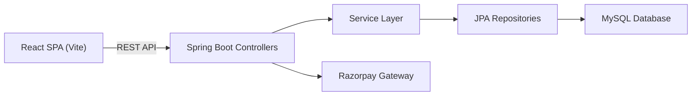
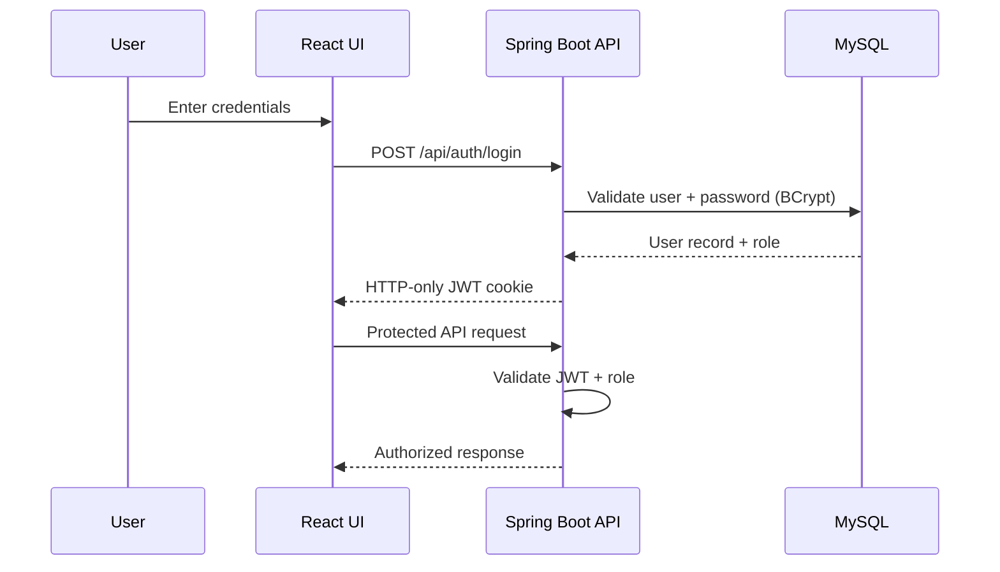
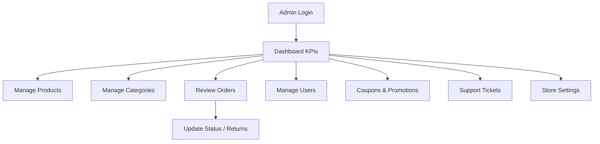
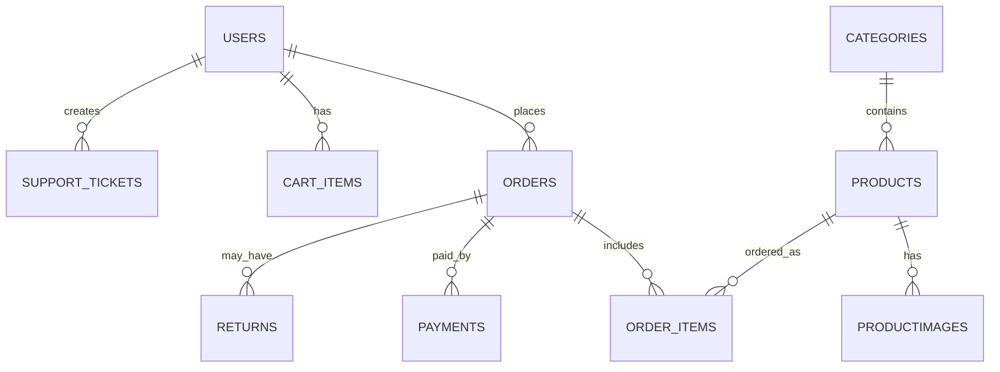
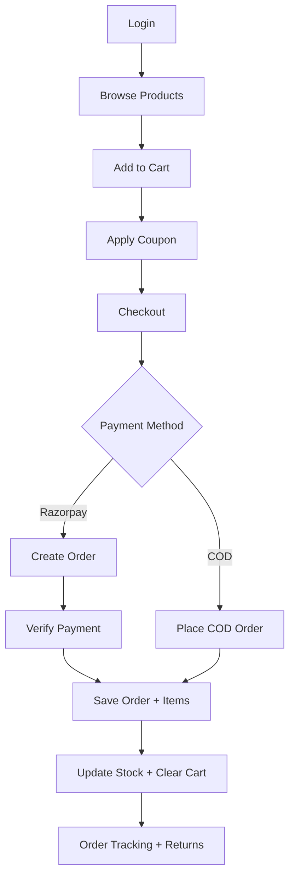
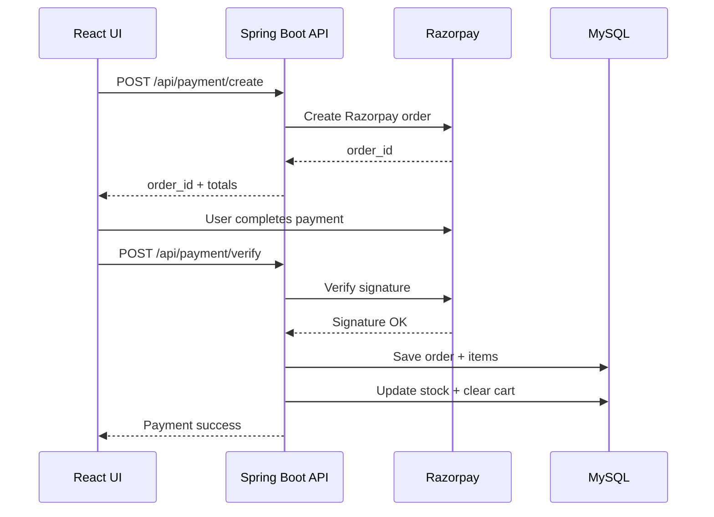

# NexCart
Full-Stack E-Commerce System  
Project Report

Prepared By: Anupam Kumar 
Date: March 2026

---

## Table of Contents
1. Project Overview  
2. Technology Stack  
3. System Architecture  
4. Features  
5. Modules  
6. Database Design  
7. API Documentation  
8. Workflow  
9. Key Logic / Algorithms  
10. Security Features  
11. Challenges Faced  
12. Future Improvements  
13. Interview Preparation  
14. 30-Second Interview Explanation  

---

# 1. Project Overview

## 1.1 Project Title
NexCart

## 1.2 Project Description (5-6 lines)
NexCart is a full-stack e-commerce platform designed to replicate real-world shopping workflows.  
Customers can browse products, filter and search listings, manage a cart, apply coupons, and checkout with Razorpay or Cash on Delivery.  
The system includes JWT-based authentication stored in HTTP-only cookies and role-based access control.  
An admin dashboard manages catalog, orders, users, coupons, support tickets, and system settings.  
The backend is built with Spring Boot and persists data in MySQL using JPA/Hibernate.  

## 1.3 Problem Statement
Retail teams often lack a unified platform to handle catalog management, secure checkout, order tracking, and customer support. This leads to operational inefficiencies and inconsistent customer experience.

## 1.4 Objective of the Project
To build a scalable and secure end-to-end e-commerce system with customer and admin workflows, covering browsing, ordering, payments, and post-purchase support.

## 1.5 Target Users
- Online shoppers (customers)
- Store administrators and operations teams
- Business owners managing product catalogs and sales

---

# 2. Technology Stack

Frontend Technologies
- React 19
- React Router 7
- Vite
- Tailwind CSS
- Axios, Recharts, Framer Motion, Lucide Icons

Backend Technologies
- Spring Boot 3.4
- Spring Web
- Spring Data JPA
- JWT (JJWT)
- BCrypt
- Razorpay Java SDK

Database
- MySQL

Tools Used
- Maven
- Node.js / npm

---

# 3. System Architecture

## 3.1 Frontend to Backend Communication
The React SPA communicates with the backend using REST APIs. All authenticated requests include credentials for HTTP-only cookies holding the JWT.

## 3.2 Backend to Database Interaction
The backend uses Spring Data JPA repositories to map entities to MySQL tables and perform CRUD operations and query-based filtering.

## 3.3 Overall Application Flow
1. User logs in and receives a JWT cookie.  
2. Product list is fetched via `/api/products`.  
3. Cart actions are handled through `/api/cart/*`.  
4. Checkout calculates totals and payment is initiated.  
5. Payment verification confirms the order and updates stock.  
6. User views order status and can request returns/refunds.  

Architecture Summary  
React (Vite) UI -> REST APIs -> Spring Boot Services -> JPA/Hibernate -> MySQL

### Architecture Diagram

### Authentication and Authorization Flow

---

# 4. Features

- User registration and login with JWT authentication
- Product listing with search, filters, pagination
- Product details with reviews
- Cart management with stock validation
- Checkout with coupons, tax, and shipping rules
- Razorpay payment integration and verification
- COD (Cash on Delivery) checkout flow
- Order tracking, invoice view/download
- Return/refund requests with ticket automation
- Wishlist (local storage)
- Support center and ticket management
- Admin dashboard for catalog, users, orders, coupons, settings, analytics

---

# 5. Modules

## 5.1 User Authentication Module
Handles login, logout, JWT creation, and cookie-based session management. Blocks unauthorized access and enforces admin-only routes.

## 5.2 Product and Catalog Module
Provides product listing, category filtering, detailed product views with images, and admin CRUD for products and categories.

## 5.3 Cart and Checkout Module
Supports add/update/delete cart items, calculates totals with discounts, and validates stock before checkout.

## 5.4 Payment Module
Integrates Razorpay for online payments and COD for offline payments. Verifies signature and updates payment status.

## 5.5 Orders and Returns Module
Tracks customer orders, supports invoice generation, and handles return/refund requests with order status updates.

## 5.6 Support Module
Allows customers to create tickets, view help center info, and track requests. Admin can update tickets.

## 5.7 Admin Dashboard Module
Manages products, orders, users, coupons, settings, analytics, and support tickets.

### Admin Operations Flow

---

# 6. Database Design

## Key Tables

users  
- user_id, username, email, password, role, blocked, status, last_login_at  
- profile fields: phone, avatar_url, address_line1, city, state, postal_code, country  

products  
- product_id, name, description, price, stock_quantity, product_status, category_id  

categories  
- category_id, category_name, image_url  

productimages  
- image_id, product_id, image_url  

cart_items  
- id, user_id, product_id, quantity  

orders  
- order_id, user_id, subtotal_amount, shipping_amount, tax_amount, total_amount  
- discount_amount, coupon_code, payment_method, order_status, payment_status, tracking_number  

order_items  
- id, order_id, product_id, quantity, price_per_unit, total_price  

payments  
- id, order_id, razorpay_payment_id, razorpay_signature, user_id, amount, status  

coupons  
- id, code, discount_type, discount_value, minimum_order_amount, maximum_discount  
- expiry_date, usage_limit, used_count, active  

returns  
- id, order_id, product_id, user_id, request_type, status, refund_status, refund_amount  

support_tickets  
- id, ticket_number, user_id, type, priority, status, subject, message  

system_settings  
- setting_key, setting_value  

## Relationships
- One user -> many orders, cart items, support tickets  
- One order -> many order_items  
- One product -> many productimages, order_items  
- One category -> many products  

## ER Diagram (Simplified)

---

# 7. API Documentation

## Customer APIs

| Endpoint | Method | Purpose | Request Parameters | Response |
|---|---|---|---|---|
| /api/auth/login | POST | User login | username, password | JWT cookie + user info |
| /api/auth/logout | POST | Logout | none | success message |
| /api/auth/me | GET | Current user | none | user profile |
| /api/users/register | POST | Register user | user JSON | created user |
| /api/users/profile | GET | User profile | none | profile data |
| /api/users/profile | PUT | Update profile | profile JSON | updated profile |
| /api/users/password | PUT | Change password | currentPassword, newPassword | status message |
| /api/products | GET | Product list | category, q, page, size | products + pagination |
| /api/products/{id} | GET | Product detail | product id | product + reviews |
| /api/categories | GET | Categories | none | categories list |
| /api/cart/items | GET | Cart items | none | cart details |
| /api/cart/items/count | GET | Cart count | username | count |
| /api/cart/add | POST | Add to cart | productId, quantity | status |
| /api/cart/update | PUT | Update quantity | productId, quantity | status |
| /api/cart/delete | DELETE | Remove item | productId | no content |
| /api/coupons/validate | POST | Validate coupon | code, subtotal | discount info |
| /api/payment/create | POST | Create Razorpay order | checkout payload | order JSON |
| /api/payment/verify | POST | Verify payment | razorpay ids/signature | success/fail |
| /api/payment/cod | POST | COD checkout | checkout payload | order totals |
| /api/orders | GET | User orders | none | order list |
| /api/orders/{orderId}/return-request | POST | Return/refund | productId, reason, requestType | status |
| /api/reviews/{productId} | GET | Reviews | productId | review list |
| /api/reviews | POST | Add review | productId, rating, comment | review |
| /api/store/highlights | GET | Store highlights | none | delivery/offers |
| /api/store/coupons | GET | Active coupons | none | coupons list |
| /api/support/tickets | POST | Create ticket | subject, message, etc | ticket info |
| /api/support/tickets/my | GET | My tickets | none | tickets list |
| /api/support/track-order/{orderId} | GET | Track order | orderId | tracking info |

## Admin APIs

| Endpoint | Method | Purpose | Request Parameters | Response |
|---|---|---|---|---|
| /admin/dashboard/overview | GET | KPI overview | days | dashboard stats |
| /admin/products/add | POST | Add product | product JSON | created product id |
| /admin/products/update | PUT | Update product | product JSON | updated product |
| /admin/products/delete | DELETE | Delete product | productId | status |
| /admin/categories | GET | List categories | none | categories list |
| /admin/categories | POST | Add category | categoryName, imageUrl | category |
| /admin/categories | PUT | Update category | categoryId, categoryName | category |
| /admin/categories | DELETE | Delete category | categoryId | status |
| /admin/orders | GET | All orders | none | orders list |
| /admin/orders/status | PUT | Update status | orderId, status | updated order |
| /admin/orders/return-status | PUT | Return status | orderId, status | updated return |
| /admin/users | GET | List users | q, status, page, size | user list |
| /admin/users/{id} | GET | User detail | user id | user info |
| /admin/users/{id}/block | PUT | Block user | none | updated user |
| /admin/users/{id}/unblock | PUT | Unblock user | none | updated user |
| /admin/users/{id} | DELETE | Delete user | none | status |
| /admin/coupons | GET | Coupons | none | list |
| /admin/coupons | POST | Create coupon | coupon JSON | coupon |
| /admin/coupons/{id} | PUT | Update coupon | coupon JSON | coupon |
| /admin/coupons/{id}/status | PATCH | Toggle coupon | active | coupon |
| /admin/settings | GET | Settings | none | grouped settings |
| /admin/settings | PUT | Update settings | settings JSON | status |
| /admin/support/tickets | GET | Support tickets | status, q | list |
| /admin/support/tickets/{ticketNumber} | PUT | Update ticket | status, adminNote | ticket |

---

# 8. Workflow

1. User logs in and receives a JWT cookie.  
2. Frontend fetches products and categories.  
3. User adds items to cart; stock is validated.  
4. Checkout calculates totals using system settings.  
5. Payment order is created (Razorpay) or COD is placed.  
6. Payment verification confirms order and updates inventory.  
7. Orders page shows status, invoice, and return/refund options.  

## Workflow Diagram

## Payment Verification Sequence

---

# 9. Key Logic / Algorithms

- JWT authentication with cookie-based sessions  
- Stock validation before cart updates and order confirmation  
- Dynamic pricing: shipping, taxes, discounts  
- Razorpay signature verification for secure payments  
- Return/refund workflow with automated support ticket creation  

---

# 10. Security Features

- BCrypt hashing for passwords  
- JWT signed with HS512  
- HTTP-only cookies  
- Role-based access control for admin routes  
- Input validation and controlled CORS  

---

# 11. Challenges Faced

- SPA authentication consistency: solved with JWT cookies and backend filter enforcement  
- Stock consistency during checkout: solved with transactional updates  
- Complex totals (tax, shipping, coupon): centralized logic in PaymentService  

---

# 12. Future Improvements

- Refresh tokens with rotation  
- Redis caching for product catalog  
- Advanced search (ElasticSearch)  
- Automated email/SMS notifications  
- Increased test coverage and CI pipeline  

---

# 13. Interview Preparation (15 Questions + Answers)

1. Why use JWT with cookies?  
Because HTTP-only cookies protect tokens from XSS and keep sessions secure.

2. How do you prevent overselling?  
Stock is validated on cart updates and again during order confirmation.

3. What happens if Razorpay verification fails?  
Order status is marked FAILED and payment status is updated accordingly.

4. How is discount applied?  
Coupon validation checks expiry, usage limit, and minimum order amount before applying.

5. How are shipping charges calculated?  
Shipping rules are pulled from SystemSettings in the database.

6. How is admin access secured?  
A role check in AuthenticationFilter blocks non-admins from /admin routes.

7. How do return requests work?  
Returns are allowed only after delivery and create a support ticket.

8. Why use JPA?  
It reduces boilerplate and maps entities cleanly to tables.

9. What are the most important tables?  
users, products, orders, order_items, payments, returns.

10. How is order status tracked?  
Enum-based workflow stored in the orders table.

11. How is payment confirmed?  
Razorpay signature verification ensures authenticity.

12. How does the system handle coupons?  
Coupons are validated for activity, expiry, and usage limits.

13. How do you manage settings?  
Settings are stored in system_settings and cached in the backend.

14. How are invoices handled?  
Invoices are generated on the frontend from order data.

15. What is a key improvement you would add?  
Caching and background jobs for notifications and order updates.

---

# 14. 30-Second Interview Explanation

NexCart is a full-stack e-commerce platform built with React and Spring Boot. It supports product browsing, cart management, coupon-based checkout, and payments through Razorpay or COD. Authentication is JWT-based with HTTP-only cookies, and orders are handled transactionally with stock checks. There is also a full admin dashboard for managing products, users, orders, coupons, and support tickets.

---
