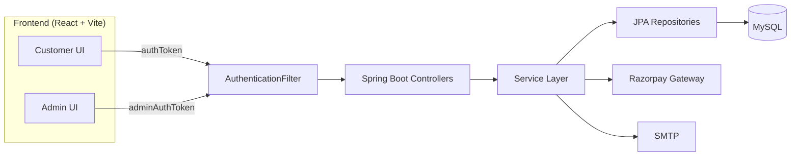
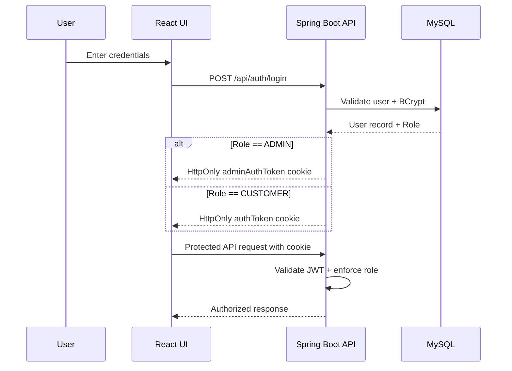
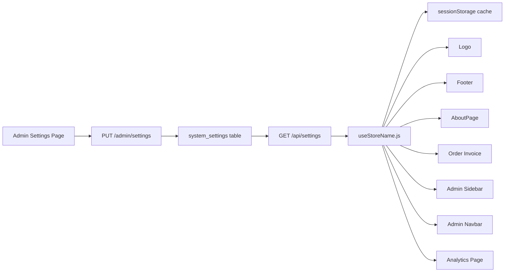

# NexCart
Full-Stack E-Commerce System
Project Report

Prepared By: Anupam Kumar
Date: May 2026

---

## Table of Contents
1. Project Overview
2. Technology Stack
3. System Architecture
4. Features
5. Modules
6. Database Design
7. API Documentation
8. Workflow
9. Key Logic / Algorithms
10. Security Features
11. Challenges Faced
12. Future Improvements
13. Interview Preparation
14. 30-Second Interview Explanation

---

# 1. Project Overview

## 1.1 Project Title
NexCart

## 1.2 Project Description
NexCart is a full-stack e-commerce platform that mirrors real-world shopping operations. Customers can browse products, apply coupons, manage carts, and complete checkout using Razorpay or Cash on Delivery. The system uses JWT authentication stored in HttpOnly cookies with a **dual-cookie architecture** that isolates Admin and Customer sessions. Admin workflows include catalog management, order processing, coupon control, analytics, support ticketing, and store settings. Admins can rename the store from the Settings page, and the change propagates across the entire UI instantly via the `useStoreName.js` React hook. The backend is built with Spring Boot and persists data in MySQL via JPA/Hibernate.

## 1.3 Problem Statement
Retail teams often lack a unified platform for catalog, checkout, order tracking, and customer support, which creates operational inefficiencies and a fragmented customer experience.

## 1.4 Objective
Build a scalable, secure end-to-end commerce system that includes customer and admin workflows from discovery through post-purchase support.

## 1.5 Target Users
- Online shoppers
- Store administrators and operations teams
- Business owners managing catalog and sales

---

# 2. Technology Stack

Frontend
- React 19, React Router 7, Vite 7
- Tailwind CSS 4, custom CSS
- Axios, Recharts, Framer Motion, Lottie

Backend
- Spring Boot 3.4 (Java 17)
- Spring Web, Spring Data JPA
- JWT (jjwt), BCrypt
- Razorpay Java SDK
- JavaMail for password reset

Database
- MySQL

Tools
- Maven, Node.js, npm

---

# 3. System Architecture

## 3.1 Frontend to Backend Communication
The React SPA communicates with the backend via REST APIs. Authenticated requests include cookies for JWT — `authToken` for customer routes, `adminAuthToken` for admin routes. Admin requests are enforced by a role check in the backend filter.

## 3.2 Backend to Database Interaction
Spring Data JPA repositories map entities to tables and perform CRUD and query-based operations. Transactional flows ensure stock and order consistency.

## 3.3 Overall Application Flow
1. User logs in and receives an HttpOnly JWT cookie (role-specific)
2. Products are fetched via `/api/products`
3. Cart actions are handled via `/api/cart/*`
4. Checkout calculates totals, shipping, tax, and coupon discount from system settings
5. Payment is initiated via Razorpay or COD
6. Payment verification confirms order and updates stock
7. User tracks orders and can request returns or refunds

### Architecture Diagram

### Dual-Cookie Authentication Flow

### Dynamic Branding Flow

---

# 4. Features

Customer
- Registration, login, logout, profile updates
- Product discovery with category filtering and search
- Product detail pages with images and reviews
- Cart management with stock validation
- Coupon discovery and validation
- Checkout with shipping, tax, and payment method rules from system settings
- Razorpay and COD payment flows
- Order history and tracking with downloadable invoices
- Return and refund requests
- Support ticket creation and help center content
- Password reset with captcha and rate limiting

Admin
- Dashboard KPIs and business analytics
- Product and category management
- Order status updates and return handling
- Customer search and account control
- Coupon management
- Support ticket queue and reset audit logs
- **Dynamic store name management** — rename the store from Settings; propagates across all UI
- Store configuration (shipping, tax, payment methods)

---

# 5. Modules

## 5.1 Authentication Module
- JWT issued on login, stored in HttpOnly cookies
- **Dual-cookie system**: `authToken` for Customer, `adminAuthToken` for Admin
- Allows concurrent Admin + Customer sessions without conflict
- Custom `AuthenticationFilter` for `/api/*` and `/admin/*`
- Admin role enforcement and blocked user checks

## 5.2 Dynamic Branding Module
- `useStoreName.js` React hook fetches store name from `GET /api/settings`
- Caches result in `sessionStorage` to avoid redundant fetches
- Store name is stored in `system_settings` table as a key-value entry
- Admin edits via `AdminSettingsController` persist and propagate to all consumers

## 5.3 Catalog Module
- Product and category CRUD on admin side
- Customer listing, details, and inventory checks

## 5.4 Cart and Checkout Module
- Cart add, update, delete with stock validation
- Checkout totals derived from `system_settings` (shipping rules, tax rate, payment options)

## 5.5 Payment Module
- Razorpay order creation and server-side signature verification
- COD order creation and stock reservation

## 5.6 Orders and Returns Module
- User order history with totals and status
- Return requests only after delivery
- Return requests auto-create support tickets

## 5.7 Support Module
- Customer tickets, help center content, and contact details
- Admin ticket queue and updates

## 5.8 Admin Dashboard Module
- Business metrics, order ops, user management, and settings across 10 pages

---

# 6. Database Design

Key tables
- users, jwt_tokens, password_reset_tokens, password_reset_audit
- categories, products, productimages
- cart_items, orders, order_items
- payments, coupons, reviews
- returns, support_tickets, system_settings

Relationships
- One user → many orders, cart items, support tickets
- One order → many order_items
- One product → many productimages, order_items, reviews
- One category → many products

ER diagram is available in `DATABASE_SCHEMA.md`.

---

# 7. API Documentation

Customer APIs
- `/api/auth/*`, `/api/users/*`, `/api/products/*`, `/api/cart/*`
- `/api/payment/*`, `/api/orders/*`, `/api/support/*`
- `/api/settings`, `/api/store/*`, `/api/coupons/*`, `/api/reviews/*`

Admin APIs
- `/admin/dashboard/*`, `/admin/business/*`, `/admin/products/*`
- `/admin/orders/*`, `/admin/users/*`, `/admin/coupons/*`
- `/admin/settings/*`, `/admin/support/*`, `/admin/notifications/*`

Full API documentation is in `API_DOCUMENTATION.md`.

---

# 8. Workflow

1. User logs in and receives role-appropriate JWT cookie
2. Frontend fetches products and categories
3. User adds items to cart; stock is validated
4. Checkout calculates totals using system settings
5. Payment order is created or COD is placed
6. Verification confirms order and updates inventory
7. User tracks orders and can request returns
8. Admin manages catalog, orders, customers, and settings from the admin panel

Workflow diagrams are in `WORKFLOW.md`.

---

# 9. Key Logic / Algorithms
- **Dual-cookie JWT**: Login sets either `authToken` or `adminAuthToken` based on role; `AuthenticationFilter` routes accordingly
- **Dynamic branding**: `useStoreName.js` hook with `sessionStorage` caching reads store name from `system_settings`
- Stock validation during cart updates and payment verification (prevents overselling)
- Totals calculation with shipping, tax, and coupon rules pulled from `system_settings`
- Razorpay HMAC-SHA256 signature verification
- Return workflow — delivery check before accepting, auto ticket creation
- Password reset — captcha + rate limiting + token expiry + audit logging

---

# 10. Security Features
- BCrypt hashing for passwords
- JWT signing with HS512; stored in `jwt_tokens` for revocation
- **Dual HttpOnly cookies** (`authToken` + `adminAuthToken`) — no XSS token exposure
- Role-based access control (`AuthenticationFilter`)
- Captcha + rate limiting on password reset
- Account blocking — denied access regardless of token
- CORS locked to trusted origins with `allowCredentials=true`

---

# 11. Challenges Faced
- Consistent SPA auth handling across customer and admin routes without session conflicts
- Implementing dual-cookie isolation so Admin and Customer can be logged in simultaneously
- Stock consistency across cart and payment flows
- Totals calculation with dynamic settings
- Making the store name propagate to all UI components without hardcoded strings

---

# 12. Future Improvements
- Refresh token rotation and session analytics
- Redis caching for products and settings (replaces `sessionStorage`)
- Advanced search and indexing
- CI pipeline with full test suite
- Notification system for orders and support updates
- WebSocket notifications for real-time order status

---

# 13. Interview Preparation

1. Why use JWT with cookies?
HttpOnly cookies reduce token exposure to XSS and simplify session handling compared to localStorage.

2. Why two cookies (authToken and adminAuthToken)?
To allow concurrent Admin and Customer sessions on the same browser (e.g., localhost) without cookie name collisions.

3. How do you prevent overselling?
Stock is validated on cart operations and again during payment confirmation.

4. What happens if payment verification fails?
The order is marked failed and payment status is updated accordingly.

5. How are discounts applied?
Coupon validation checks expiry, usage limits, and minimum order amount server-side.

6. How are shipping charges calculated?
Shipping rules are pulled from `system_settings` and applied in `PaymentService`.

7. How is admin access secured?
`AuthenticationFilter` reads `adminAuthToken`, verifies it, and checks `Role.ADMIN` before forwarding to any `/admin/*` controller.

8. How do return requests work?
Returns are allowed only after delivery and generate support tickets automatically.

9. Why use JPA?
It reduces boilerplate and maps entities to SQL tables cleanly; relationships are managed via annotations.

10. What are the most important tables?
users, products, orders, order_items, payments, system_settings, returns.

11. How is payment confirmed?
Razorpay HMAC-SHA256 signature verification ensures authenticity before the order is saved.

12. How are settings managed?
Settings are stored in `system_settings` (key-value) and served via `SystemSettingsService` which groups them by category (store, shipping, tax, payment).

13. How is password reset protected?
Captcha, rate limiting, and audit logging are enforced. Reset tokens are short-lived.

14. How does the store name change work end-to-end?
Admin updates the value in Settings → saved to `system_settings` → `useStoreName.js` hook re-fetches from `/api/settings` on next component mount → all UI components render the new name.

15. What would you improve next?
Add Redis for caching, refresh token rotation, and a WebSocket-based notification system.

16. How is admin visibility ensured?
Admin dashboards and audit logs provide operational insight. Password reset audit logs are exportable as CSV.

---

# 14. 30-Second Interview Explanation
NexCart is a full-stack e-commerce platform built with React and Spring Boot. It covers the entire shopping lifecycle from product discovery and cart management to checkout and payment via Razorpay or COD. Authentication uses a dual-cookie JWT system — `authToken` for customers and `adminAuthToken` for admins — enabling concurrent sessions without conflict. Admin workflows handle catalog, orders, customers, coupons, support tickets, and store settings including a dynamic store name that propagates across the entire UI. All data is persisted in MySQL with JPA, and the system ensures stock consistency, provides configurable shipping and tax rules, and includes captcha-protected password reset with audit logging.
