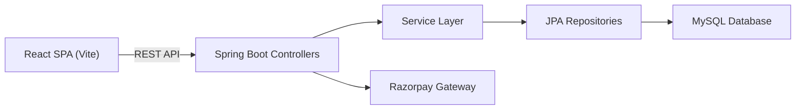
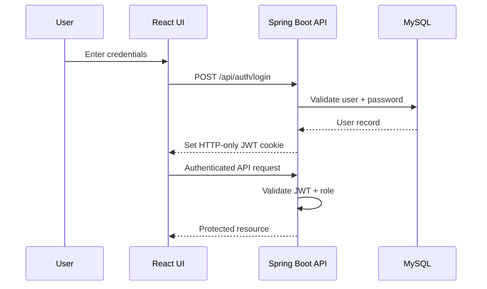
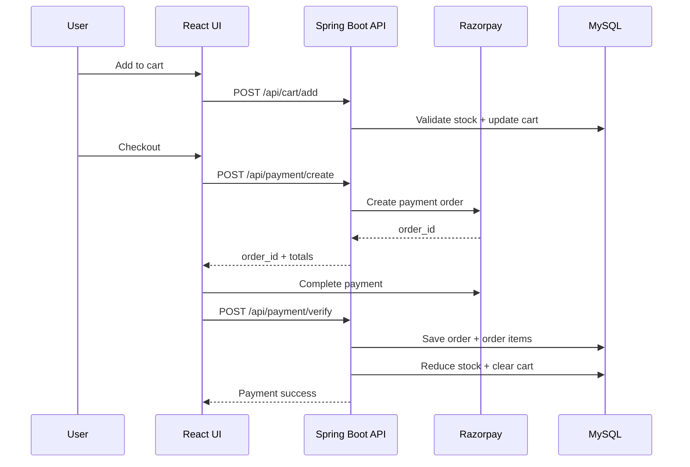
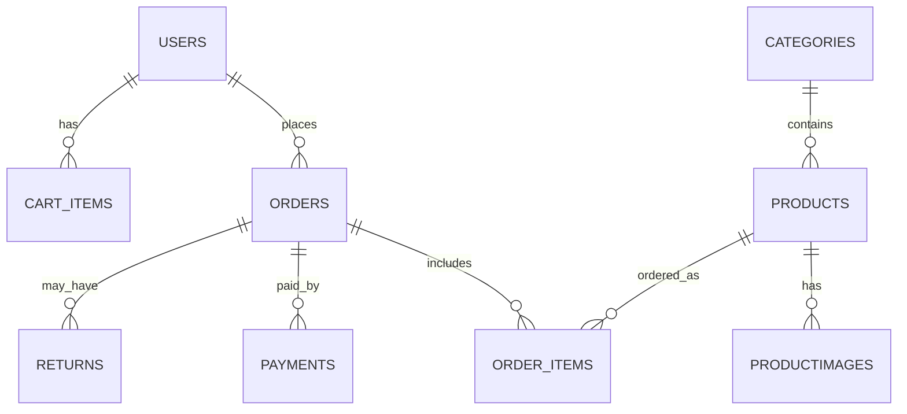
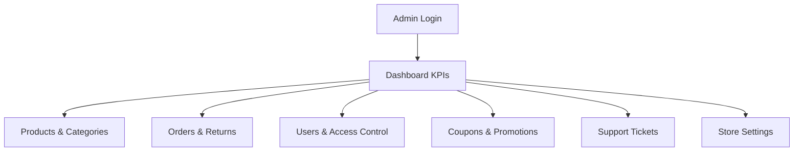

# NexCart

A full-stack e-commerce platform with a customer storefront, secure checkout, and an admin dashboard for catalog, order, and support operations. The frontend is a React (Vite) SPA and the backend is Spring Boot with JPA/Hibernate backed by MySQL. It supports JWT authentication via HTTP-only cookies, Razorpay payments, coupon validation, order tracking, and return/refund workflows.

## Tech Stack

Frontend
- React 19, React Router 7
- Vite
- Tailwind CSS
- Axios, Recharts, Framer Motion, Lucide Icons

Backend
- Spring Boot 3.4
- Spring Web, Spring Data JPA
- JWT (JJWT), BCrypt
- Razorpay Java SDK

Database
- MySQL

Tools
- Maven, Node.js, npm

## Project Structure

```
NexCart/
- NexCartFrontend/         # React frontend
  - src/
    - pages/               # Customer + Admin pages
    - components/          # UI and feature components
    - admin/               # Admin layout, pages, services
    - routes/              # App routes
- nexcartBackEnd/          # Spring Boot backend
  - src/main/java/...      # Controllers, services, entities
  - src/main/resources/db  # SQL schema + seed + migrations
```

## Architecture Diagram



## Authentication Flow



## Checkout Workflow Diagram



## Features

- User registration and login with JWT authentication
- Product listing with search, filters, pagination
- Product details with reviews
- Cart management with stock checks
- Checkout with coupons, tax, shipping rules
- Razorpay payment integration and verification
- COD (Cash on Delivery) checkout flow
- Order tracking, invoice view/download
- Returns and refunds with ticket automation
- Admin dashboard for products, categories, orders, users, coupons, support, settings, business analytics

## Installation

Backend (Spring Boot)
1. Go to `nexcartBackEnd`
2. Configure database + secrets in `src/main/resources/application.properties`
3. Run:
   ```
   ./mvnw spring-boot:run
   ```
   Server runs on `http://localhost:9090`

Frontend (React)
1. Go to `NexCartFrontend`
2. Install dependencies:
   ```
   npm install
   ```
3. Run:
   ```
   npm run dev
   ```
   Client runs on `http://localhost:5174`

## Usage

- Visit `http://localhost:5174`
- Login as a customer or use the admin login at `/admin`
- Admin bootstrap credentials are in `nexcartBackEnd/src/main/resources/application.properties`

## API Summary

All APIs are served by the backend at `http://localhost:9090`.

Customer APIs (sample)
- `POST /api/auth/login`
- `GET /api/products`
- `POST /api/cart/add`
- `POST /api/payment/create`
- `POST /api/payment/verify`

Admin APIs (sample)
- `GET /admin/dashboard/overview`
- `POST /admin/products/add`
- `PUT /admin/orders/status`
- `GET /admin/support/tickets`

Full API documentation is in the project report.

## Database Diagram



## Admin Dashboard Overview



## Contributing

Pull requests are welcome. Please open an issue first to discuss major changes.
