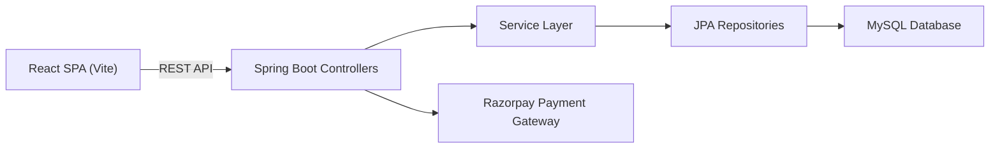
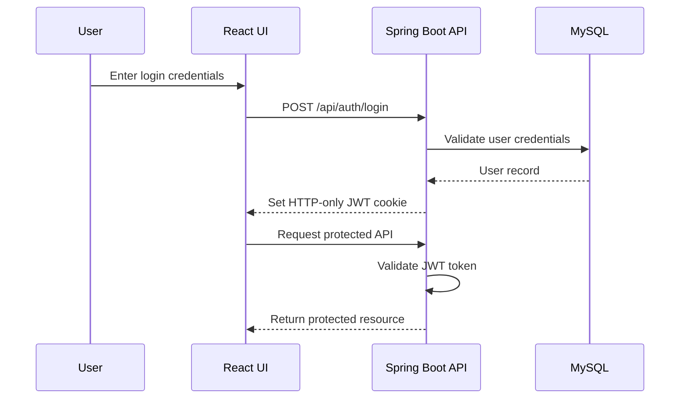
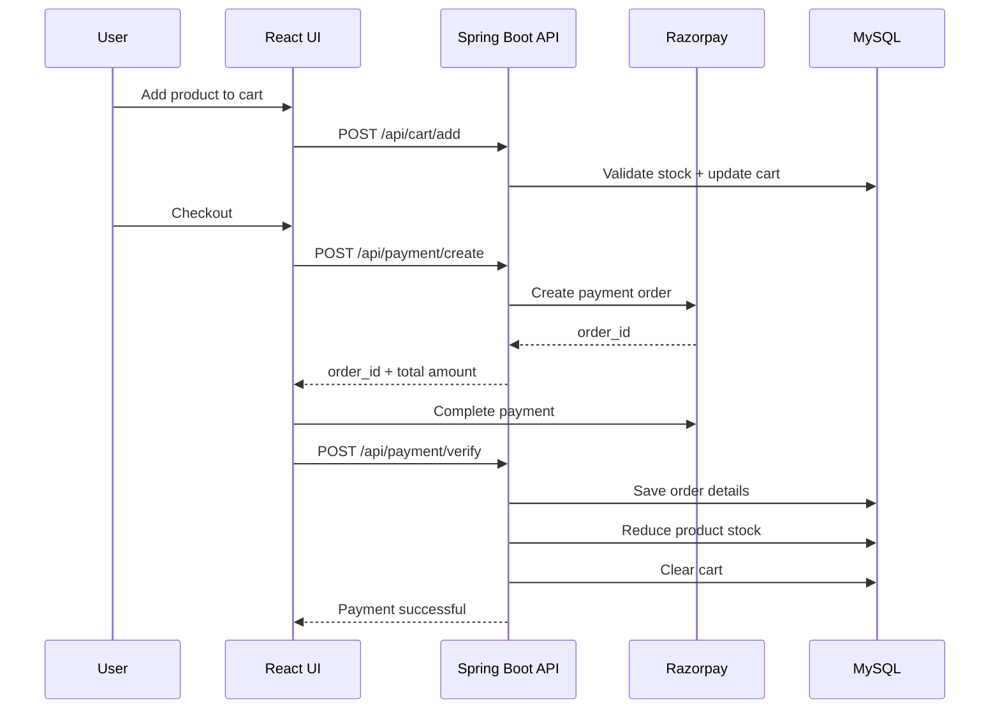
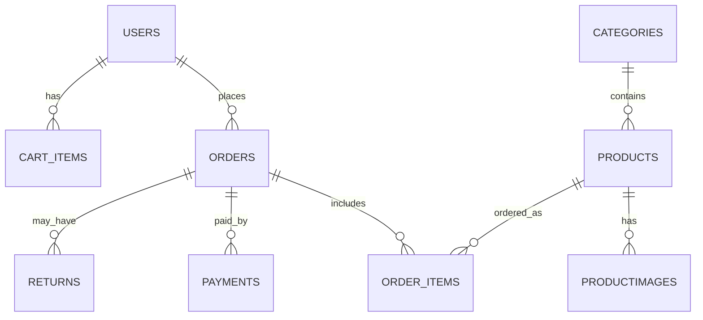
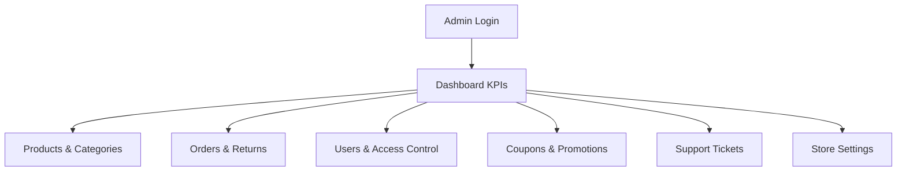
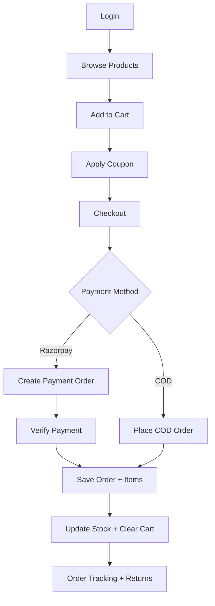
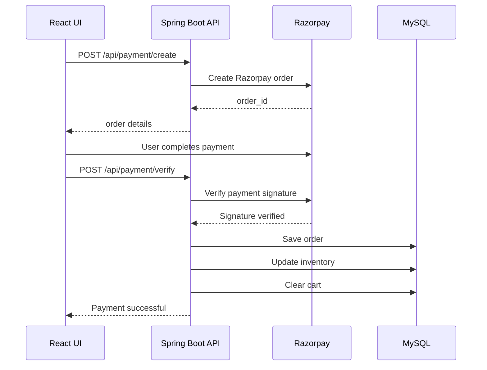

# NexCart – Full Stack E-Commerce Platform

NexCart is a full-stack e-commerce platform designed to provide a complete online shopping experience.  
It includes a **customer storefront**, **secure checkout**, and an **admin dashboard** for managing products, orders, users, and support operations.

The **frontend** is built with **React (Vite)** and the **backend** uses **Spring Boot with JPA/Hibernate**, connected to a **MySQL database**.

The system supports:

- JWT authentication using HTTP-only cookies
- Razorpay payment integration
- Coupon validation
- Order tracking
- Return and refund workflows
- Admin analytics dashboard

---

# Tech Stack

## Frontend
- React 19
- React Router 7
- Vite
- Tailwind CSS
- Axios
- Recharts
- Framer Motion
- Lucide Icons

## Backend
- Spring Boot 3.4
- Spring Web
- Spring Data JPA
- JWT Authentication (JJWT)
- BCrypt Password Hashing
- Razorpay Java SDK

## Database
- MySQL

## Tools
- Maven
- Node.js
- npm

---

# Project Structure

```
NexCart/
│
├── NexCartFrontend/           # React Frontend (Customer + Admin UI)
│   └── src/
│       ├── pages/             # Customer and Admin pages
│       ├── components/        # Reusable UI components
│       ├── admin/             # Admin layout, services and features
│       └── routes/            # Application routing
│
└── nexcartBackEnd/            # Spring Boot Backend
    └── src/main/
        ├── java/              # Controllers, Services, Entities
        └── resources/
            └── db/            # SQL schema, seed data, migrations
```

---

# System Architecture



---

# Authentication Flow



---

# Checkout Workflow



---

# Features

## Customer Features
- User registration and login with JWT authentication
- Product listing with search, filters, and pagination
- Product detail page with reviews
- Shopping cart with stock validation
- Secure checkout process
- Razorpay payment gateway integration
- Cash on Delivery (COD) option
- Order tracking
- Invoice view and download
- Return and refund request system

## Admin Features
- Admin dashboard with business analytics
- Product and category management
- Order and return management
- User management
- Coupon and promotion management
- Customer support ticket system
- Store configuration and settings

---

# Installation Guide

## Backend Setup (Spring Boot)

1. Navigate to backend folder

```
cd nexcartBackEnd
```

2. Configure database and secrets in

```
src/main/resources/application.properties
```

3. Run backend server

```
./mvnw spring-boot:run
```

Backend runs at

```
http://localhost:9090
```

---

## Frontend Setup (React)

1. Navigate to frontend folder

```
cd NexCartFrontend
```

2. Install dependencies

```
npm install
```

3. Start development server

```
npm run dev
```

Frontend runs at

```
http://localhost:5174
```

---

# Usage

1. Open the application

```
http://localhost:5174
```

2. Register or login as a customer.

3. Admin users can access the admin panel

```
/admin
```

Admin bootstrap credentials are available in

```
nexcartBackEnd/src/main/resources/application.properties
```

---

# API Overview

All APIs are served from

```
http://localhost:9090
```

## Customer APIs

```
POST /api/auth/login
GET /api/products
POST /api/cart/add
POST /api/payment/create
POST /api/payment/verify
```

## Admin APIs

```
GET  /admin/dashboard/overview
POST /admin/products/add
PUT  /admin/orders/status
GET  /admin/support/tickets
```

---

# Database Schema



---

# Admin Dashboard Overview



---

# Application Workflow

1. User logs in and receives a JWT authentication cookie  
2. Frontend fetches products and categories  
3. User adds items to cart  
4. System validates stock availability  
5. Checkout calculates tax, shipping, and coupons  
6. User selects Razorpay or COD payment  
7. Payment verification confirms order  
8. System updates inventory and clears cart  
9. User can track orders and request returns  

---

# Workflow Diagram



---

# Payment Verification Flow



---

# Contributing

Pull requests are welcome.

Please open an issue first to discuss major changes before submitting a pull request.
