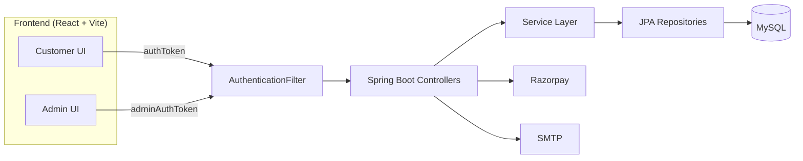
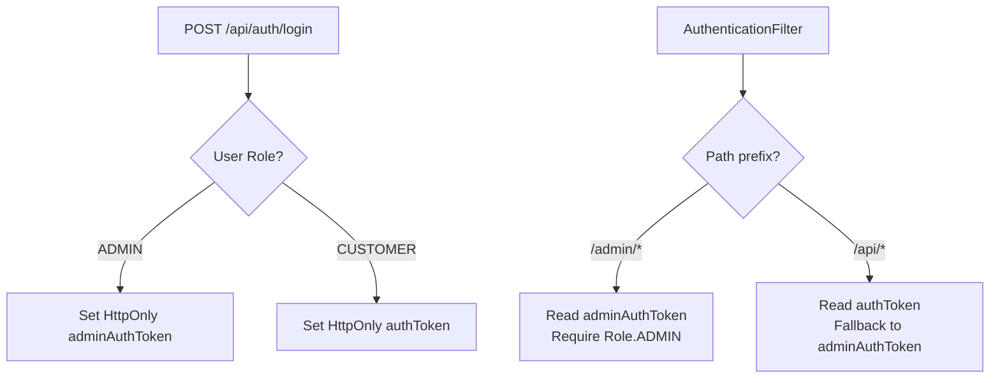

# NexCart - Full Stack E-Commerce Platform

[](./LICENSE)
[](https://github.com/annnuuupam)

## Project Title
NexCart

## Project Overview
NexCart is a full-stack e-commerce platform that delivers a complete customer shopping journey and a dedicated admin operations console. The frontend is a React (Vite) single-page app and the backend is a Spring Boot REST API backed by MySQL. Authentication uses a **dual-cookie JWT system** — `authToken` for Customer sessions and `adminAuthToken` for Admin sessions — enabling concurrent logins without conflicts. Core flows include catalog browsing, cart management, checkout, payments, order tracking, returns, and customer support. The Admin can also rename the store from the Settings page, and the change propagates across the entire UI via the `useStoreName.js` hook.

## Problem Statement
Growing retail teams often juggle separate tools for catalog management, secure checkout, order lifecycle, and post-purchase support. That fragmentation leads to operational bottlenecks and inconsistent customer experiences.

## Solution Description
NexCart consolidates customer and admin workflows into a single platform. The customer app focuses on browsing, cart, checkout, and support. The admin console provides catalog management, order operations, customer management, coupon control, analytics, and system settings. A Spring Boot API enforces role-based access, secures sessions via dual-cookie JWT, and coordinates payments via Razorpay or COD.

## Complete Feature List
Customer features
- Account registration, login, logout, and profile management
- Product listing with search and category filtering
- Product detail page with images and reviews
- Cart management with stock validation
- Coupon discovery and validation
- Checkout with shipping, tax, and payment method selection (from system settings)
- Razorpay checkout and COD flow
- Order history with tracking and downloadable invoices
- Return and refund requests
- Support center content and ticketing
- Password reset with captcha and rate limiting

Admin features
- Business dashboard overview and analytics
- Product and category CRUD with image management
- Order status and return management
- Customer search, block/unblock, and profile edits
- Coupon lifecycle management
- Support ticket queue and reset audit logs
- **Store name control** — rename the store from the Admin Settings page; all UI components update automatically
- System settings for shipping, tax, and payment options
- Password reset email template editing
- Notification management

For a full breakdown, see `FEATURES.md`.

## Tech Stack
Frontend
- React 19, React Router 7, Vite 7
- Tailwind CSS 4, custom CSS
- Axios, Fetch
- Recharts, Framer Motion, Lottie

Backend
- Spring Boot 3.4 (Java 17)
- Spring Web, Spring Data JPA
- JWT (jjwt), BCrypt
- Razorpay Java SDK
- JavaMail (password reset emails)

Database
- MySQL

Tools
- Maven, Node.js, npm

## System Architecture Overview


## Dual-Cookie Authentication


## Dynamic Store Branding
Admin can rename the store from the Settings page. The `useStoreName.js` hook reads the name from `GET /api/settings` and distributes it to all branding-sensitive components: Logo, Footer, About page, Order invoices, Admin Sidebar, Admin Navbar, and Analytics page.

## Folder Structure
```
NexCart/
+-- NexCartFrontend/          # React customer + admin UI
+-- nexcartBackEnd/           # Spring Boot REST API
+-- dashboard_import/         # Separate admin dashboard template (not integrated)
+-- README.md                 # Main project documentation
+-- DOCUMENTATION_INDEX.md    # Documentation landing page
+-- ARCHITECTURE.md           # System architecture + Mermaid diagrams
+-- API_DOCUMENTATION.md      # REST API reference
+-- DATABASE_SCHEMA.md        # Database schema and ER diagram
+-- FEATURES.md               # Feature inventory
+-- WORKFLOW.md               # Workflows and sequence diagrams
+-- SECURITY.md               # Security design and dual-cookie auth
+-- DEPLOYMENT.md             # Deployment guide
+-- FOLDER_STRUCTURE.md       # Full directory tree
+-- PROJECT_REPORT.md         # Project report and interview prep
```

See `FOLDER_STRUCTURE.md` for a full directory tree.

## Installation Instructions
Prerequisites
- Java 17
- Maven 3.9+
- Node.js 18+
- MySQL 8+

Backend setup
1. Configure database and secrets in `nexcartBackEnd\src\main\resources\application.properties`.
2. Run the backend:
```bash
cd nexcartBackEnd
./mvnw spring-boot:run
```
Backend runs at `http://localhost:9090`.

Frontend setup
1. Configure API base URL in `NexCartFrontend\.env.local`:
```
VITE_API_URL=http://localhost:9090
```
2. Run the frontend:
```bash
cd NexCartFrontend
npm install
npm run dev
```
Frontend runs at `http://localhost:5174`.

## Running the Application
1. Start MySQL and ensure the `nexcart` database is available.
2. Start the backend on port 9090.
3. Start the frontend on port 5174.
4. Open `http://localhost:5174` for customer login.
5. Open `http://localhost:5174/admin` for admin login.

Admin bootstrap credentials
- Username and password are defined in `application.properties` under `admin.bootstrap.*`.

## Environment Variables
Frontend
- `VITE_API_URL` = backend base URL

Backend (recommended as environment variables in production)
- `SPRING_DATASOURCE_URL`
- `SPRING_DATASOURCE_USERNAME`
- `SPRING_DATASOURCE_PASSWORD`
- `JWT_SECRET`
- `RAZORPAY_KEY_ID`
- `RAZORPAY_KEY_SECRET`
- `SPRING_MAIL_HOST`, `SPRING_MAIL_PORT`, `SPRING_MAIL_USERNAME`, `SPRING_MAIL_PASSWORD`
- `APP_FRONTEND_BASE_URL`, `APP_FRONTEND_RESET_PATH`

See `DEPLOYMENT.md` for production guidance.

## Build Instructions
Frontend
```bash
cd NexCartFrontend
npm run build
```
Output: `NexCartFrontend\dist`

Backend
```bash
cd nexcartBackEnd
./mvnw -DskipTests package
```
Output: `nexcartBackEnd\target\*.jar`

## Deployment Instructions
- Backend can be deployed as a Spring Boot jar or via Docker (see `nexcartBackEnd\Dockerfile`).
- Frontend can be deployed to Vercel, Netlify, or any static host.

Full deployment instructions are in `DEPLOYMENT.md`.

## Future Enhancements
- Refresh token rotation and session management dashboard
- Background jobs for emails and order notifications
- Redis caching for products and settings (replaces sessionStorage)
- Advanced search and faceted filtering
- CI pipeline with automated tests and linting
- WebSocket notifications for real-time order status

## Additional Docs
- `DOCUMENTATION_INDEX.md`
- `ARCHITECTURE.md`
- `API_DOCUMENTATION.md`
- `DATABASE_SCHEMA.md`
- `FEATURES.md`
- `WORKFLOW.md`
- `SECURITY.md`
- `DEPLOYMENT.md`
- `CONTRIBUTING.md`
- `FOLDER_STRUCTURE.md`
- `PROJECT_REPORT.md`
