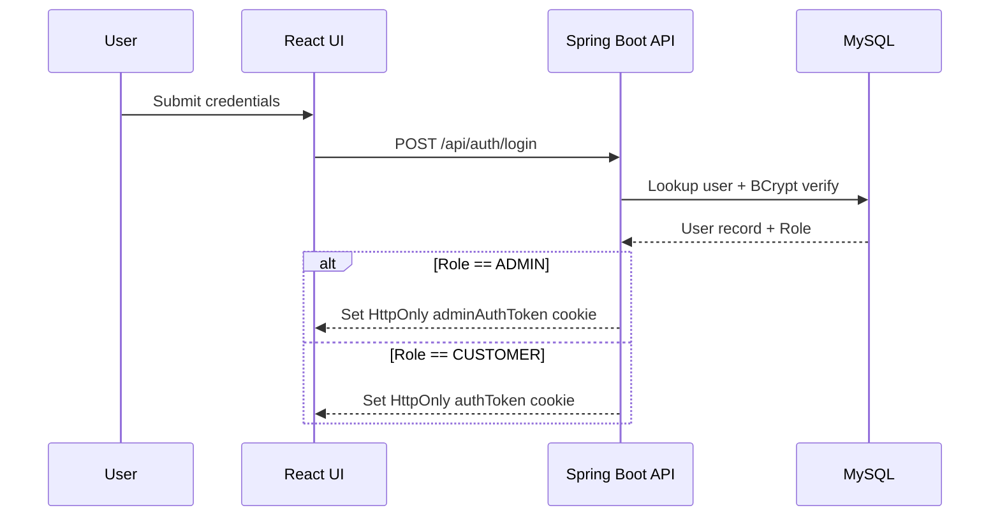
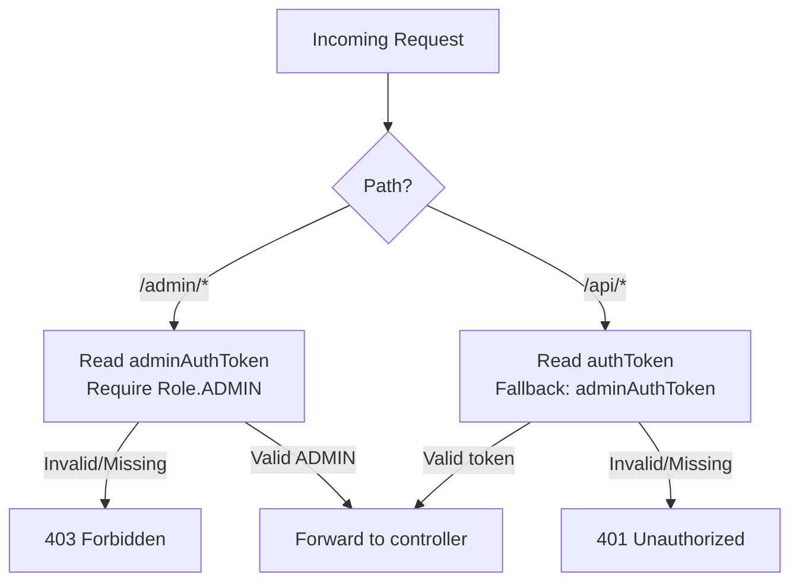

# NexCart Security

## Authentication — Dual-Cookie System
NexCart uses a **dual-cookie JWT architecture** to isolate Admin and Customer sessions:

| Cookie | Role | Scope |
|---|---|---|
| `authToken` | Customer / Standard user | `/api/*` endpoints |
| `adminAuthToken` | Administrator (Role.ADMIN) | `/admin/*` endpoints |

This separation allows an Admin and a Customer to be logged in simultaneously on the same browser (e.g., `localhost`) without cookie conflicts.

### Login Flow

### Logout Flow
- `POST /api/auth/logout` clears **both** `authToken` and `adminAuthToken` cookies, regardless of which was active.

### Token Revocation
- JWT tokens are stored in the `jwt_tokens` table for server-side revocation on logout.
- Expiry defaults to **1 hour**.

## Authorization

- `AuthenticationFilter` protects all `/api/*` and `/admin/*` routes
- Admin-only routes require `Role.ADMIN`
- Blocked users are denied access regardless of token validity

## Password Handling
- Passwords are hashed with **BCrypt**
- Password reset flow requires:
  1. Captcha verification (`CaptchaService`)
  2. Rate limiting (`PasswordResetRateLimiter`)
  3. Short-lived reset tokens stored in `password_reset_tokens`
  4. Audit logging in `PasswordResetAuditService`

## Cookie Configuration
| Property | Value |
|---|---|
| HttpOnly | Yes (not accessible via JavaScript) |
| SameSite | Lax (local) / None (secure origins) |
| Token expiry | 1 hour (default) |
| Cookie names | `authToken`, `adminAuthToken` |

## Data Validation
- Request payloads are validated in services and controllers for required fields
- Stock checks occur both on cart updates and during payment verification

## Security Controls in the Codebase
| Component | Responsibility |
|---|---|
| `AuthenticationFilter` | JWT validation and role enforcement |
| `CaptchaService` | Generates and verifies math captchas for password reset |
| `PasswordResetRateLimiter` | Limits reset requests per IP / identifier |
| `PasswordResetAuditService` | Records all reset attempts with IP and user agent |
| `BCryptPasswordEncoder` | Password hashing during registration and verification |

## CORS and Origin Restrictions
- CORS is restricted to trusted domains in `CorsConfig` and `AuthenticationFilter`
- Requests must include credentials (`credentials: "include"`) for authenticated access
- `allowCredentials=true` is enforced alongside explicit allowed origins

## Dynamic Branding Security Note
- `GET /api/settings` is a protected endpoint (`authToken` required) that returns the `storeName` used in dynamic branding
- Store name is only modifiable via the Admin panel (`PUT /api/settings` requires `adminAuthToken` with `Role.ADMIN`)

## Recommendations for Production
- Move credentials and secrets from `application.properties` to environment variables
- Rotate `JWT_SECRET` and Razorpay keys regularly
- Enable HTTPS and `Secure` flag on cookies
- Use `SameSite=None` only on HTTPS origins
- Add rate limiting to login and payment endpoints
- Consider Spring Security configuration for additional protections
- Add monitoring for suspicious login and reset activity
