# NexCart Workflows

## User Authentication Flow — Dual-Cookie

### Customer Login
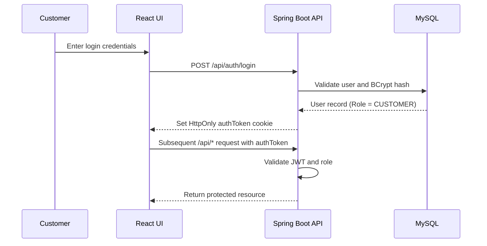

### Admin Login
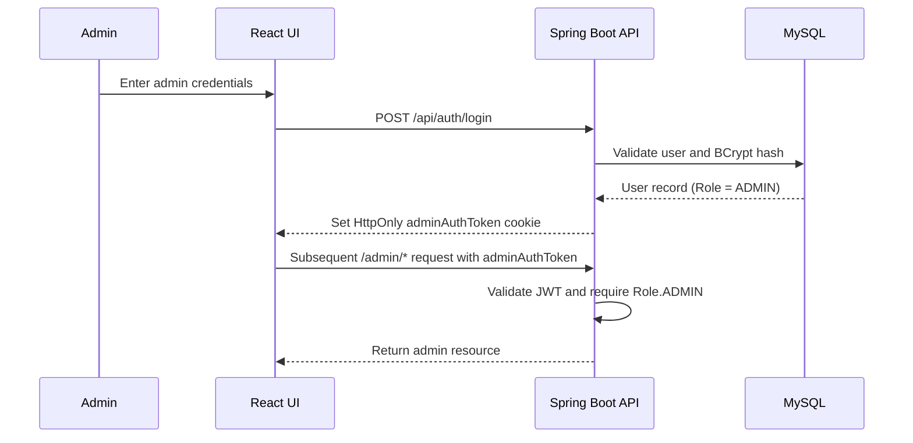

### Concurrent Session (Both Logged In)
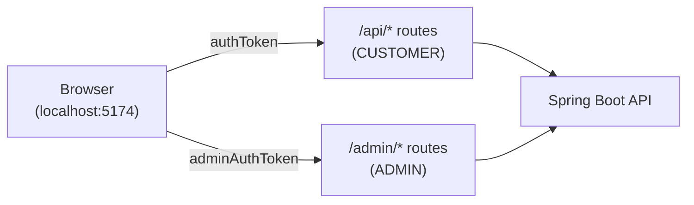

## API Request Lifecycle
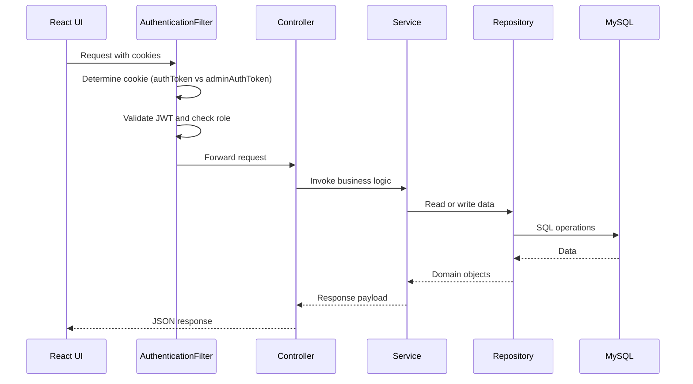

## Checkout and Payment Flow
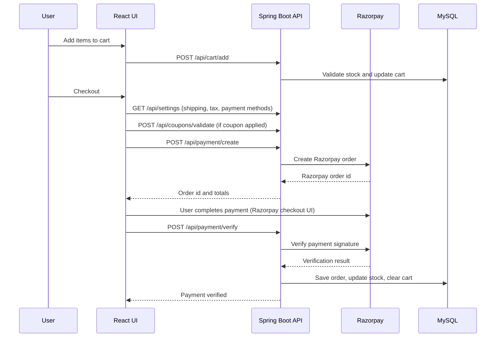

## COD Order Flow
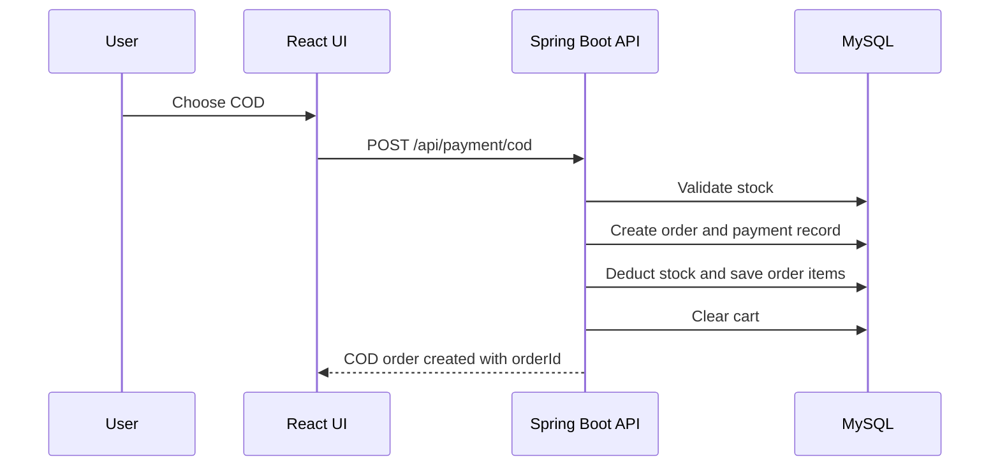

## Return and Refund Flow
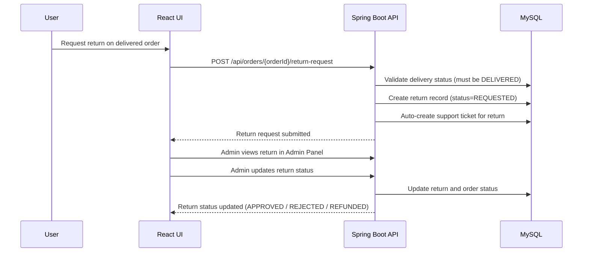

## Support Ticket Workflow
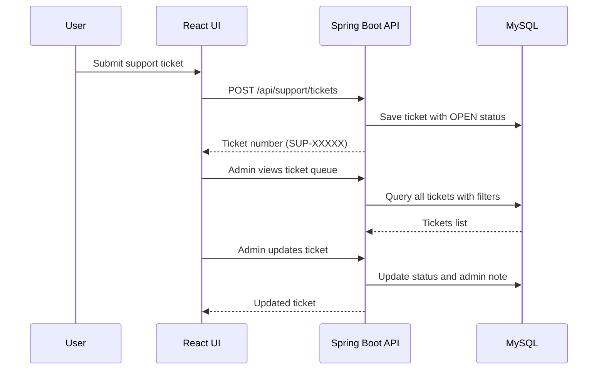

## Password Reset Workflow
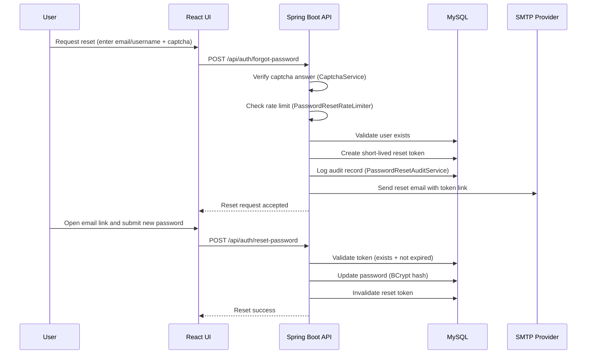

## Dynamic Branding Flow
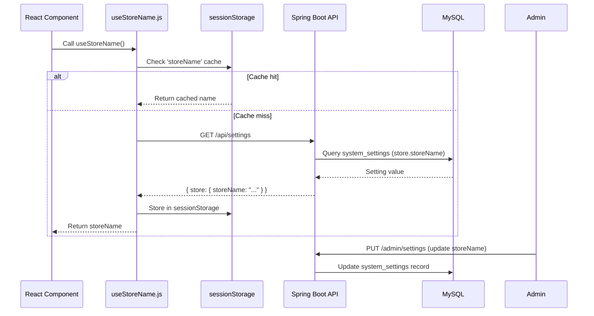

## Admin Store Name Update Flow
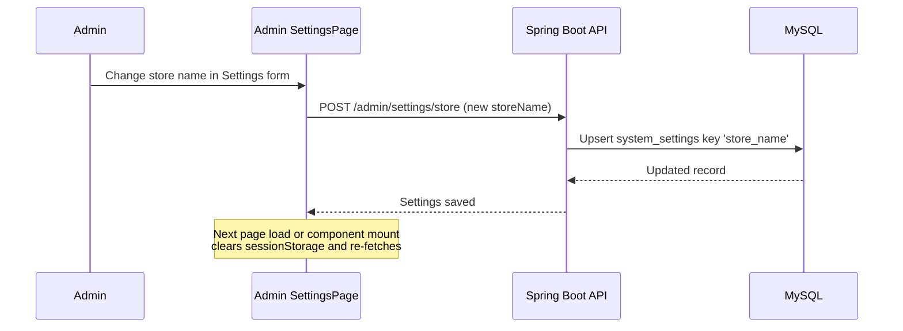

## Data Processing Flow
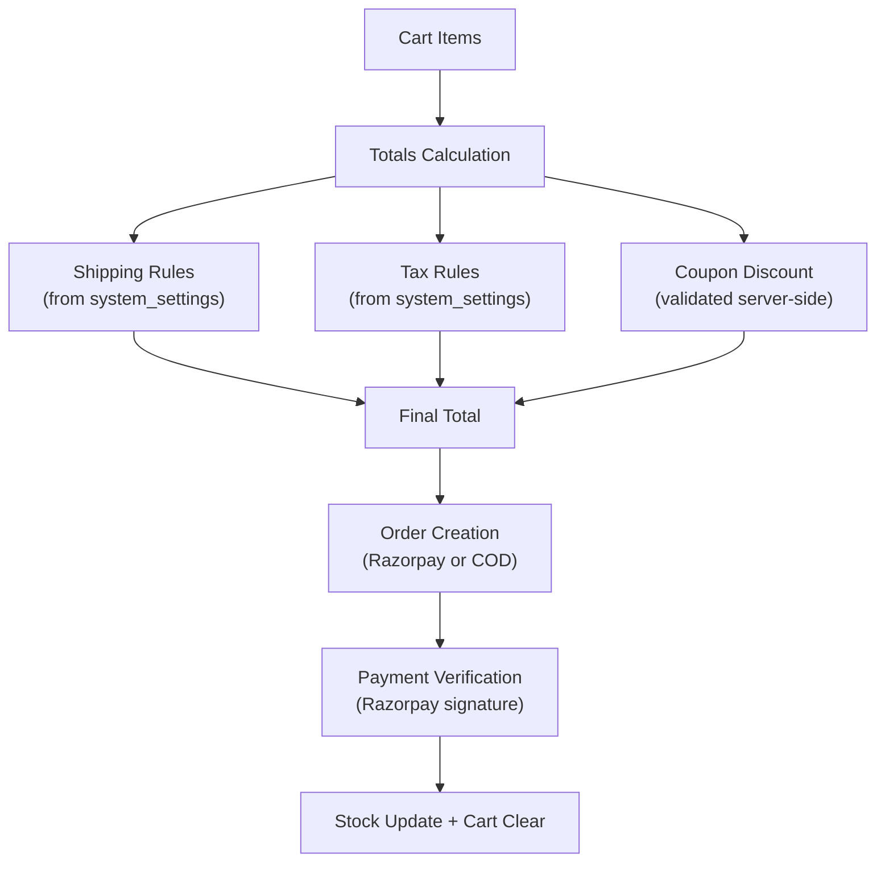
